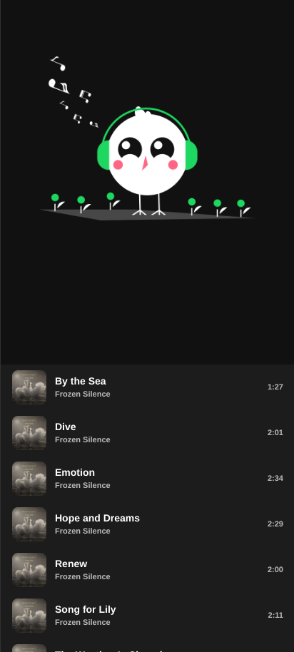
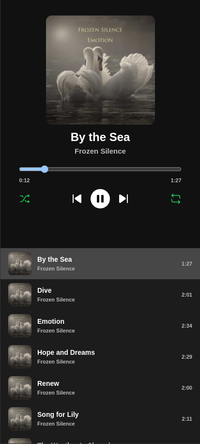

# Music Player 🎵

A responsive music player built with React and TypeScript. This project showcases modern UI design, smooth transitions, and powerful audio management, making it easy to enjoy and control your music playlists.

## Features

- 🎶 **Play/Pause music**: Start and stop your favorite tracks easily.
- ⏭️ **Next/Previous track**: Skip to the next or previous song in the playlist.
- 🎧 **Playlist management**: Easily switch between songs from a dynamic playlist.
- 📱 **Responsive design**: Optimized for all screen sizes (mobile, tablet, desktop).
- 🚀 **Fast performance**: Enjoy smooth and seamless transitions.

## Demo

Here are a few snapshots of the music player:
<p align="center">
  
  
  
</p>

## Tech Stack

- **React**: Frontend framework
- **TypeScript**: Typed JavaScript for scalable code
- **SCSS**: Styling with modular and reusable styles
- **HTML5 Audio API**: Handling audio playback
- **Vitest**: Testing the project

## Installation

1. Clone the repository:
   ```bash
   git clone https://github.com/pourya22334415/Music-Player.git && cd Music-Player

2. Install requirements:
    ```bash
    # with npm:
    npm i
    # with yarn: 
    yarn

3. Run the project:
    ```bash
    # with npm:
    npm run dev
    # with yarn:
    yarn dev
